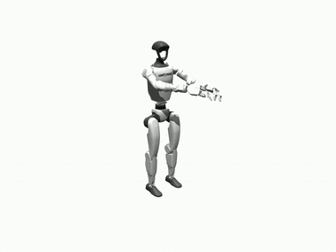
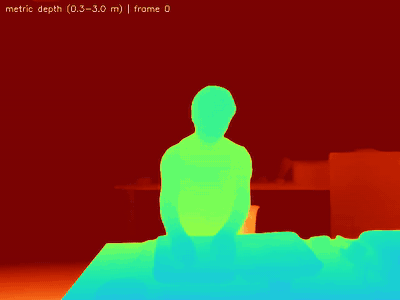
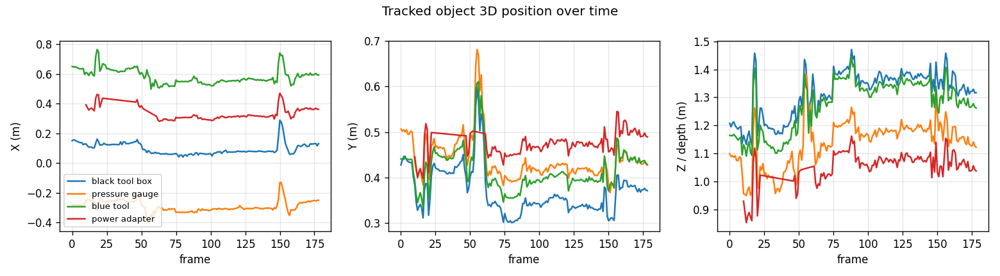
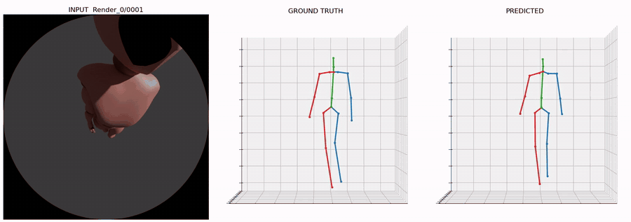

# 3D Pose — Egocentric Hand & Object Reconstruction

**XP Robotics**

Reconstructing **3D hand–object interaction from a single RGB video** — no depth
sensor, no calibration, no markers. Metric depth, 3D hand meshes for both hands,
text-promptable object detection with 6DoF tracking, and motion retargeted onto a robot.

📄 [Capability summary](CAPABILITY.md) &nbsp;·&nbsp; 📦 [Delivered data](data/)

---

## ⭐ Robot Retargeting

Recovered hand motion mapped onto a bimanual robot, driven end-to-end from raw video.

▶️ [Full video](outputs/robot_retarget.mp4)

---

## Results

<table>
  <tr>
    <td width="33%" align="center"><b>3D Hand Mesh</b> MANO meshes on the input video  </td>
    <td width="33%" align="center"><b>3D Scene Reconstruction</b> depth cloud + hand meshes + objects  </td>
    <td width="33%" align="center"><b>Hand &amp; Object Tracking</b> keypoints + open-vocab masks  </td>
  </tr>
  <tr>
    <td align="center"><b>Metric Depth</b> per-frame, single RGB camera  </td>
    <td align="center"><b>Object Segmentation</b> text-prompted, tracked  </td>
    <td align="center"><b>Object 3D Trajectories</b> per-object position over time  </td>
  </tr>
</table>

Full-resolution MP4s:
<a href="outputs/mano_overlay.mp4">hand mesh</a> ·
<a href="outputs/reconstruction_3d.mp4">3D reconstruction</a> ·
<a href="outputs/tracking_2d.mp4">tracking</a> ·
<a href="outputs/depth.mp4">depth</a> ·
<a href="outputs/object_masks.mp4">segmentation</a>

---

## 🧪 Egocentric Multi-Camera (Preview — in progress)

Early results on a **head/body-worn multi-fisheye capture** (`.mcap`). Object
detection is already strong; **hand geometry is approximate pending final camera
calibration** and will sharpen once applied. Shown as a work-in-progress preview.

<table>
  <tr>
    <td width="33%" align="center"><b>Hand &amp; Object Tracking</b>  </td>
    <td width="33%" align="center"><b>3D Hand Mesh</b> approximate calibration  </td>
    <td width="33%" align="center"><b>3D Reconstruction</b> approximate calibration  </td>
  </tr>
</table>

⚠️ Preview only — geometry approximate (calibration pending). Not final.

---

## 🧍 Egocentric 3D Human Pose

Full-body **19-joint 3D pose** from a stereo-fisheye egocentric camera —
**MPJPE 37.2 mm · PA-MPJPE 31.3 mm**. Input fisheye · ground truth · prediction.

Details &amp; method: <a href="human_pose/">human_pose/</a> &nbsp;·&nbsp; ▶️ <a href="human_pose/doc/demo.mp4">full video</a>

---

## 🖐️ ARKit LiDAR 3D Hand Tracking

3D hand tracking from **ARKit + LiDAR depth** on a mobile capture — 2D→3D
reprojection, wrist-to-head distance, camera-pose interpolation (SLERP), and
world-space 3D trajectory.

<table>
  <tr>
    <td width="50%" align="center"><b>Input</b> ARKit RGB capture  </td>
    <td width="50%" align="center"><b>Depth Overlay</b> LiDAR depth + 2D hand skeleton + wrist distance  </td>
  </tr>
  <tr>
    <td colspan="2" align="center"><b>3D Visualization</b> hand pose + head/hand trajectory in world frame  </td>
  </tr>
</table>

Details &amp; method: <a href="arkit_hand_tracking/">arkit_hand_tracking/</a> &nbsp;·&nbsp; ▶️ full videos:
<a href="arkit_hand_tracking/doc/input.mp4">input</a> ·
<a href="arkit_hand_tracking/doc/depth_overlay.mp4">depth overlay</a> ·
<a href="arkit_hand_tracking/doc/viz_3d.mp4">3D</a>

---

## Delivered Data

| File | Contents |
|---|---|
| [`data/tracking.json`](data/tracking.json) | Per-frame **3D + 2D hand keypoints**, **6DoF object poses**, **3D boxes**, labels + confidence, camera intrinsics |
| [`data/hand_meshes/`](data/hand_meshes/) | Per-frame **3D hand meshes** (`.obj`, 778 verts/hand) |
| [`data/robot_trajectory.npz`](data/robot_trajectory.npz) | **Robot joint trajectory** from retargeting |
| [`data/metrics.json`](data/metrics.json) | Quality metrics summary |

See [`data/DATA_FORMAT.md`](data/DATA_FORMAT.md) for the schema (metric metres, camera frame).

---

## Capabilities

- **Metric 3D depth** from a single RGB camera — no depth sensor or calibration
- **3D hand mesh reconstruction** — both hands, every frame
- **Open-vocabulary object detection & segmentation** — objects specified by text
- **6DoF object pose tracking** with oriented 3D bounding boxes
- **Robot retargeting** — hand motion mapped to a robot arm / humanoid
- **Interactive 3D scene viewer**

## Overview

The system takes a short RGB clip of a person interacting with objects and produces
a temporally consistent 4D reconstruction — per-frame metric depth, articulated 3D
hand meshes, and tracked 3D objects — in a single gravity-aligned world frame, and
connects perception to action by retargeting the motion onto a robot. Produced
end-to-end from raw video, with target objects specified only by text.

© XP Robotics — results generated by the XP Robotics 3D pose pipeline.

