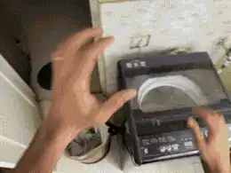
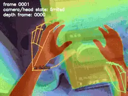
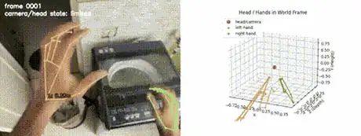

<div align="center">

# 🖐️ ARKit LiDAR-Based 3D Hand Tracking

**XP Robotics**

3D hand tracking from **ARKit + LiDAR depth** — reconstructs hand poses in camera
and world space from a mobile capture, with depth-overlay and 3D-trajectory
visualization.

</div>

---

## Pipeline Outputs

<div align="center">

**Input**  &nbsp;·&nbsp;  **Depth Overlay**




**3D Visualization**



</div>

<div align="center"><sub>▶️ Full videos: <a href="doc/input.mp4">input</a> · <a href="doc/depth_overlay.mp4">depth overlay</a> · <a href="doc/viz_3d.mp4">3D visualization</a></sub></div>

---

## Features
- 2D → 3D reprojection using LiDAR depth maps
- Wrist-to-head distance estimation
- Camera pose interpolation (SLERP)
- Depth-overlay visualization
- 3D world-space trajectory
- Reprojection-error analysis

## Pipeline at a glance
```
ARKit input → depth extraction → camera-pose interpolation → 3D reconstruction → distance estimation → visualization
```

## Outputs
- Depth-overlay video
- 3D visualization video
- Unified JSON dataset (per-frame hand pose in camera + world space)

<div align="center"><sub>© XP Robotics — ARKit LiDAR 3D hand tracking.</sub></div>
